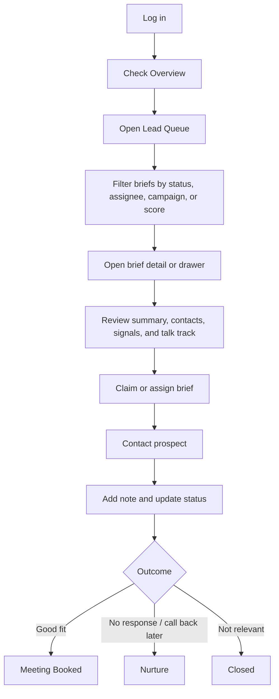
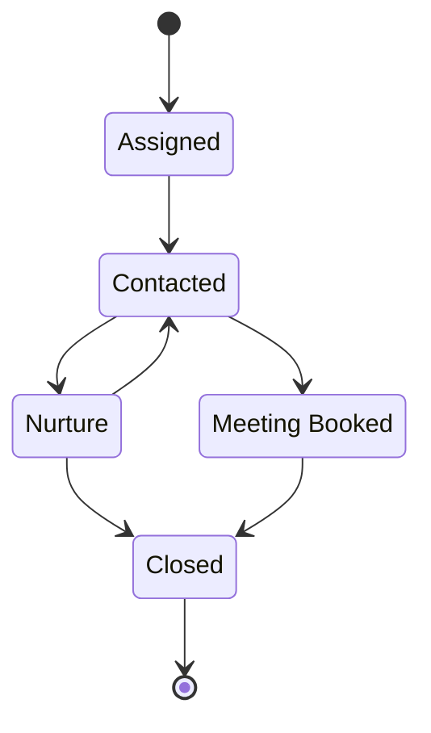

# LeadScout Portal User Guide

This guide explains how to use the LeadScout Portal day to day. It is written for sales and operations users who need to review briefs, manage outreach, record feedback, and keep prospect activity visible.

For a one-page onboarding visual, use [LeadScout Portal One-Page Guide](assets/leadscout-portal-one-page-guide.png).

## How To Use The Portal Day To Day

1. Check **Overview** for the latest portal activity, brief volume, and feedback summary.
2. Open **Lead Queue** to find briefs that need attention.
3. Filter the queue by assignment, status, campaign, signal, score, or feedback.
4. Open a brief in the drawer for a quick review, or open the full brief page for deeper work.
5. Review the executive summary, fit rationale, contacts, signals, and recommended talk track.
6. Claim the brief or assign it to the right team member.
7. Contact the prospect using the captured contact details, generated email draft, or LinkedIn draft.
8. Add a note after meaningful activity so others can see what happened.
9. Update assignment status as outreach progresses.
10. Mark contacted, meeting booked, and brief feedback accurately.

## Portal Sections

### Overview

Use **Overview** as the starting point. It gives a quick read on generated briefs, feedback quality, recent finalized briefs, and latest activity.

Good usage:

- Check it at the start of a working session.
- Use it to spot whether new briefs or recent feedback need attention.
- Treat it as a summary, then move into **Lead Queue**, **Feedback**, or **Analytics** for detail.

### Lead Queue

Use **Lead Queue** to find and manage briefs. This is the main working list for sales and operations.

Good usage:

- Filter by assignment to find your briefs, unassigned briefs, or the wider team queue.
- Filter by assignment status to focus on `Assigned`, `Contacted`, `Nurture`, `Meeting Booked`, or `Closed`.
- Use campaign, signal, score, and feedback filters to narrow the list.
- Open a drawer for quick triage, or open the full page when you need more context.
- Keep closed briefs out of day-to-day work unless you are reviewing history.

### Brief Detail And Brief Drawer

The brief drawer is useful for fast review without leaving the queue. The full brief page is better for deeper work, notes, feedback, assignment, and actions.

Use the brief content to understand:

- Why the company is a fit.
- What signals or developments matter.
- Which contacts were captured.
- Which route badges apply to each named contact.
- What angle or talk track should guide outreach.

### Contact Cards

Contact cards show named people captured for the account. They may include role, confidence, email, phone, LinkedIn, and routing badges such as `Primary buyer`, `Likely influencer`, `Likely blocker`, or `Fallback route`.

Good usage:

- Start with named contacts that have route badges.
- Use the role/title to judge whether the person fits your outreach angle.
- Use email, phone, and LinkedIn links when available.
- Do not treat a missing badge as a reason to ignore a strong contact; use the brief context as well.

### Generate Email And LinkedIn Drafts

Contact cards can generate draft outreach using the brief context and recommended angle.

Good usage:

- Use **Generate email** when the contact has an email address.
- Review and edit the email before sending.
- Use **Generate LinkedIn** when the contact has a LinkedIn profile.
- Copy the LinkedIn message and paste it into LinkedIn manually.
- Treat generated drafts as a starting point, not final copy.

### Assignment And Progress

Assignment shows who owns the brief and where it sits in the outreach lifecycle.

Status meaning:

- **Assigned**: Someone owns the brief and should review or act on it.
- **Contacted**: Outreach has happened.
- **Nurture**: The prospect may still be useful, but needs later follow-up or CRM sequencing.
- **Meeting Booked**: Outreach converted into a booked meeting.
- **Closed**: No further portal action is needed.

Good usage:

- Move the status when the activity changes.
- Use `Nurture` for no response, call-back-later, or not-now scenarios.
- Use `Closed` when the brief should no longer appear in normal active work.
- Do not use notes as a replacement for updating status.

### Brief Feedback

Brief feedback helps improve future targeting and brief quality.

Good usage:

- Mark the brief as `Good`, `Mixed`, or `Bad` based on usefulness.
- Use quick reasons to explain repeated patterns.
- Mark `Contacted` when outreach has happened.
- Mark `Meeting booked` only when a meeting is actually booked.
- Add notes for useful activity detail.

### Notes

Notes are for activity history and team visibility.

Good usage:

- Add a note after meaningful outreach, a call, a reply, or a decision.
- Keep notes factual and dated by the system.
- Include enough context for another user to understand what happened.
- Do not overwrite status with narrative; use both notes and status together.

### Quick Qualify

Use **Quick Qualify** to submit a website and generate a qualification result for a company that is not already in your queue.

Good usage:

- Enter a valid company website.
- Wait for research, scoring, and sales intelligence to complete.
- Review the score, decision, rationale, contacts, and generated brief.
- Use it for one-off checks, demos, or quick prospect research.

### Feedback

Use **Feedback** to review brief feedback across companies.

Good usage:

- Search and filter feedback by verdict, quick reason, contacted, meeting booked, notes, and dates.
- Use it to identify recurring quality issues.
- Export feedback when you need offline analysis or handover.
- Review bad or mixed feedback to improve targeting assumptions.

### Analytics

Use **Analytics** to understand performance across target accounts and briefs.

Good usage:

- Review score distribution and feedback trends.
- Use filters to compare campaigns, signal types, and verdicts.
- Look for patterns in target quality, feedback received, and campaign performance.
- Use analytics to guide operational decisions, not individual outreach copy.

### ICP Profile

Use **ICP Profile** to understand how fit is defined.

Good usage:

- Review positive and negative signals.
- Check scoring criteria when a brief result seems surprising.
- Use ICP context to understand why some accounts score higher than others.
- Raise feedback when the ICP appears misaligned with real sales experience.

### Client Context

Use **Client Context** to understand the client's market, proposition, and positioning.

Good usage:

- Review it before working unfamiliar campaigns.
- Use it to keep messaging aligned with the client proposition.
- Cross-check generated talk tracks against the client context.
- Keep feedback specific when context appears outdated or incomplete.

## Best Practices

- Use statuses for pipeline position.
- Use notes for context and activity history.
- Use feedback to improve future briefs.
- Use `Nurture` for prospects that may still be useful but need later follow-up or CRM sequencing.
- Use `Closed` when there is no further portal action needed.
- Do not use notes as a replacement for status changes.
- Keep feedback honest; it is used to improve future targeting and brief quality.
- Claim or assign briefs clearly so the team knows who owns next action.
- Review generated outreach before sending it.
- Keep CRM and portal activity aligned where possible.

## Common Workflows

### Working New Briefs

1. Open **Lead Queue**.
2. Filter to unassigned or active briefs.
3. Open a promising brief.
4. Review summary, fit, contacts, and talk track.
5. Claim or assign the brief.
6. Generate or write outreach.
7. Mark contacted and add a note.
8. Move to `Meeting Booked`, `Nurture`, or `Closed` based on outcome.

### Reviewing Team Activity

1. Open **Lead Queue**.
2. Filter by team queue or assignee.
3. Review status distribution.
4. Open briefs with stale status or missing notes.
5. Use **Feedback** and **Analytics** to spot quality or workflow patterns.

### Handling Call-Back-Later Prospects

1. Add a note with the call-back context.
2. Move the assignment to `Nurture`.
3. Pick it up later for another outreach attempt or CRM sequence.
4. Move it back to `Contacted` when outreach resumes.

## Suggested Future Improvements

- Add a follow-up due date.
- Add saved queue views.
- Add bulk status updates.
- Add CRM export for nurture prospects.
- Add a manager dashboard by assignee and status.
- Add an activity timeline combining notes, feedback, contact actions, and status changes.
